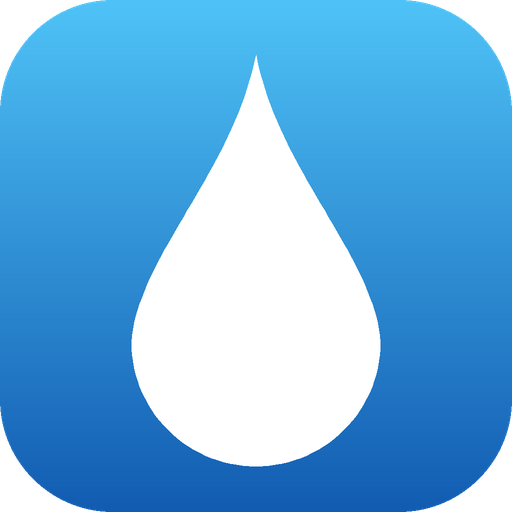
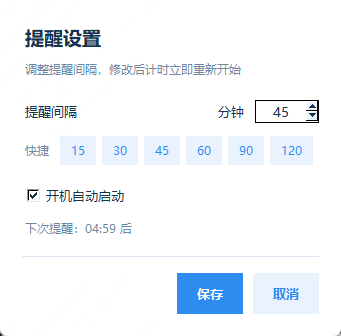

<div align="center">
  
  <h1>喝水提醒小助手</h1>
  <p><b>Water Reminder</b> · 常驻 Windows 系统托盘的喝水提醒工具</p>
  <p>单文件 exe · 免安装 · 免运行库 · 无需管理员权限</p>
</div>

---

## 功能特性

- **定时提醒** — 间隔 1~240 分钟可调，默认 45 分钟，配置自动持久化
- **右下角置顶弹窗** — 自动定位到主屏工作区右下角（避开任务栏），圆角 + 淡入动画 + 可拖动，附一声轻提示音
- **一键交互** — 弹窗内「已喝水」按设定间隔重置计时；「5 分钟后再提醒」延后提醒；右上角 ✕ 等同延后
- **系统托盘常驻** — 右键菜单：立即提醒 / 设置… / 开机自启开关 / 退出；鼠标悬停直接显示剩余时间
- **开机自启** — 写 `HKCU\Software\Microsoft\Windows\CurrentVersion\Run` 注册表项，**无需管理员权限**，托盘菜单一键开关
- **单实例运行** — 重复启动会自动忽略，不会堆出多个托盘图标
- **崩溃自留痕** — 异常堆栈写入 `%APPDATA%\WaterReminder\error.log`

## 界面预览

### 提醒弹窗


### 设置窗口



## 快速开始

> **本仓库暂不提供预编译好的 exe**，请按下面的方式自行打包或直接运行源码。
> 另外注意：程序运行后**不会弹出主窗口**，而是静默驻留系统托盘（首次运行会弹一个气泡说明）。
> 如果托盘区看不到水滴图标，点任务栏右下角的 `^` 展开隐藏图标区域，把图标拖到常显区即可。

### 方式一：打包成 exe（推荐）

```bash
cd WaterReminder
pip install pystray pillow pyinstaller
python make_icon.py
pyinstaller --noconfirm --clean --onefile --windowed ^
    --name WaterReminder --icon water.ico ^
    --hidden-import pystray._win32 main.py
```

产物在 `dist\WaterReminder.exe`，单文件约 18 MB。拷到任意 Windows 机器上双击即可运行，无需安装 Python 或任何运行库。

也可以直接双击 `build.bat` 一键完成上述所有步骤。

> exe 未做代码签名，首次运行时 Windows SmartScreen 可能提示"未知发布者"，点「更多信息」→「仍要运行」即可。

### 方式二：从源码直接运行

```bash
# 需要 Python 3.9+（Windows 版，且必须带 tkinter）
cd WaterReminder
pip install pystray pillow
python main.py
```

## 使用说明

| 想做的事 | 怎么操作 |
| --- | --- |
| 现在就想被提醒 | 托盘图标右键 → 立即提醒 |
| 改提醒间隔 | 托盘图标右键 → 设置… → 填 1~240 → 保存（也可点 15/30/45/60/90/120 快捷值） |
| 临时重新计时 | 弹窗里点「已喝水」 |
| 再拖一会儿 | 弹窗里点「5 分钟后再提醒」，或右上角 ✕ |
| 看还剩多久 | 鼠标悬停在托盘图标上 |
| 开机自动启动 | 托盘图标右键 → 开机自启（勾选即开启） |
| 彻底退出 | 托盘图标右键 → 退出 |

## 数据与自启

| 项目 | 位置 |
| --- | --- |
| 配置文件 | `%APPDATA%\WaterReminder\config.json` |
| 错误日志 | `%APPDATA%\WaterReminder\error.log` |
| 开机自启注册表项 | `HKCU\Software\Microsoft\Windows\CurrentVersion\Run` → 值名 `WaterReminder` |

卸载时删掉 exe、上面两个文件，再把注册表里那项删掉即可，不留残留。

## 技术实现

- **GUI**：Python 标准库 `tkinter`。弹窗用 `overrideredirect` 去掉系统边框 + `-topmost` 始终置顶，
  通过 `SystemParametersInfoW(SPI_GETWORKAREA)` 取工作区尺寸完成右下角定位，
  再用 `CreateRoundRectRgn` + `SetWindowRgn` 切圆角、`-alpha` 做淡入动画。
- **系统托盘**：`pystray`（Windows 后端直接调 `Shell_NotifyIcon`）。
- **线程模型**：tkinter 事件循环跑在主线程；pystray 的托盘消息循环跑在子线程。
  托盘菜单回调发生在托盘线程，禁止直接操作 Tk，统一通过 `queue` 回投主线程（80ms 轮询）执行。
  计时用主线程的 `after(1000, ...)` 每秒一跳，避免跨线程计时误差。
- **图标**：不依赖外部图片资源，`Pillow` 在启动时按贝塞尔曲线实时绘制水滴图标
  （这样托盘图标和 exe 图标同源，改一处即可）。
- **DPI 感知**：`shcore.SetProcessDpiAwareness(1)` 配合 `tk scaling = dpi / 72`，
  让窗口在 125% / 150% 缩放的屏幕上不发虚。
- **打包**：PyInstaller `--onefile --windowed`，产物约 18 MB。

## 项目结构

```
WaterReminder/
├── main.py                  # 主程序（GUI + 托盘 + 计时 + 注册表）
├── make_icon.py             # 调 main.py 的绘制函数生成 multi-size ico
├── build.bat                # 一键打包脚本
├── requirements.txt         # 运行/打包依赖
├── water.ico                # 应用图标（由 make_icon.py 生成）
├── test_smoke.py            # 冒烟测试：跑通弹窗/设置/注册表/计时，并截图核对
├── test_exe.py              # 端到端测试：真跑 exe，验证定时弹窗真的会出现
├── shot_readme.py           # 生成 README 配图
└── docs/                    # README 图片资源
```

## 环境要求

- Windows 10 / 11（x64）
- 使用 exe：无任何额外依赖
- 从源码运行：Python 3.9+，且该 Python 必须包含 tkinter
  （python.org 官方安装包默认带；Microsoft Store 版和部分精简版可能没有）

## 常见问题

**双击后什么都没发生？**
正常的。程序常驻托盘，不显示主窗口。看任务栏右下角的 `^` 展开区域。

**开机自启勾了没用？**
自启记录的是 exe 的绝对路径。如果你把 exe 挪到别处，需要重新勾一次。

**托盘图标不见了？**
程序在跑但图标被系统折叠了，点 `^` 展开；如果进程真的没了，看 `%APPDATA%\WaterReminder\error.log`。

**弹窗挡住了别的窗口？**
弹窗是置顶的，鼠标按住它能拖到别处，或者直接点 ✕ 让它 5 分钟后再来。
